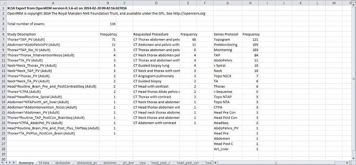
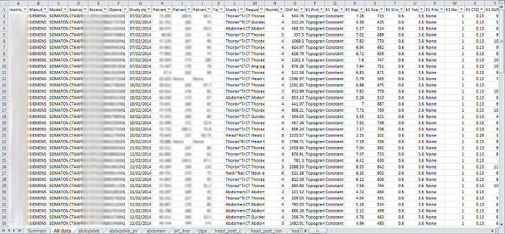
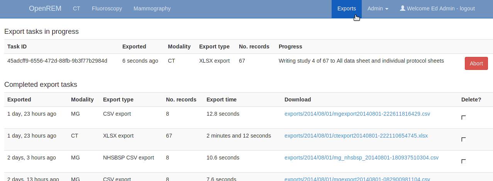
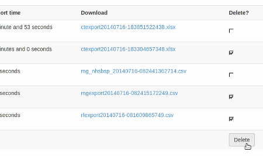

Exporting study information
***************************

Exporting to csv and xlsx sheets
================================

If you are logged in as a user in the ``exportgroup`` or the ``admingroup``,
the export links will be available near the top of the modality filter pages
in the OpenREM interface. The following exports are currently available (version 0.4.3)

* CT basic, single sheet csv
* CT advanced, XLSX muliple-sheets
* Fluoroscopy basic, single sheet csv
* Mammography, single sheet csv
* Mammogrpahy NHSBSP, single sheet csv designed to satisfy NHSPSB reporting

For CT, the XLSX export has multiple sheets. The first sheet contains a 
summary of all the study descriptions, requested procedures and series
protocol names contained in the export:

    
This information is useful for seeing what data is in the spreadsheet, and
can also be used to prioritise which studies or protocols to analyse based on
frequency.

The second sheet of the exported file lists all the studies, with each study
taking one line and each series in the study displayed in the columns to the right.

The remainder of the file has one sheet per series protocol name. Each series
is listed one per line. If a single study
has more than one series with the same protocol name, then the same study
will appear on more than one line.

Clicking the link for an export redirects you to the Exports page, which
you can also get to using the link at the top right of the navigation bar:

Whilst an export is being processed, it will be listed in the first table
at the top. The current status is displayed to indicate export progress.
If an export gets stuck for whatever reason, you may be able to abort the
process by clicking the 'Abort' button. However this does not always cause
an active export to terminate - you may find it completes anyway!

Completed exports are then listed in the second table, with a link to
download the csv or xlsx file.

When the export is no longer needed, it can be deleted from the server
by ticking the delete checkbox and clicking the delete button at the bottom:

.. warning::

    Large exports have been killed by the operating system due to running 
    out of memory - a 6500 CT exam xlsx export was killed after 3400 
    studies for example. This issue is being tracked as `#116`_ and will
    hopefully be addressed in the next release. It is possible that if debug 
    mode is turned off then memory will be managed better, but I also need
    to modify the xlsx export to make use of the memory optimisation mode in 
    xlsxwriter.

..  _`#116`: https://bitbucket.org/openrem/openrem/issue/116/
