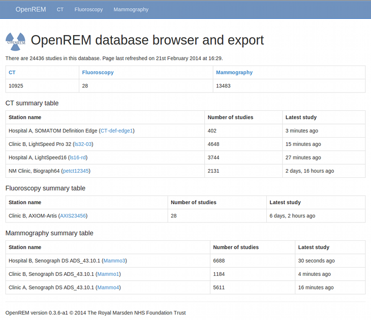
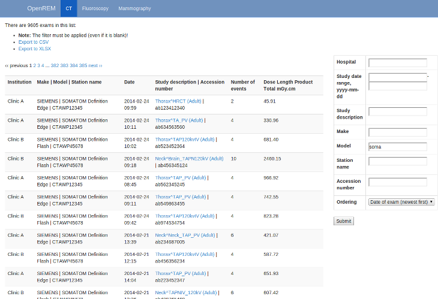
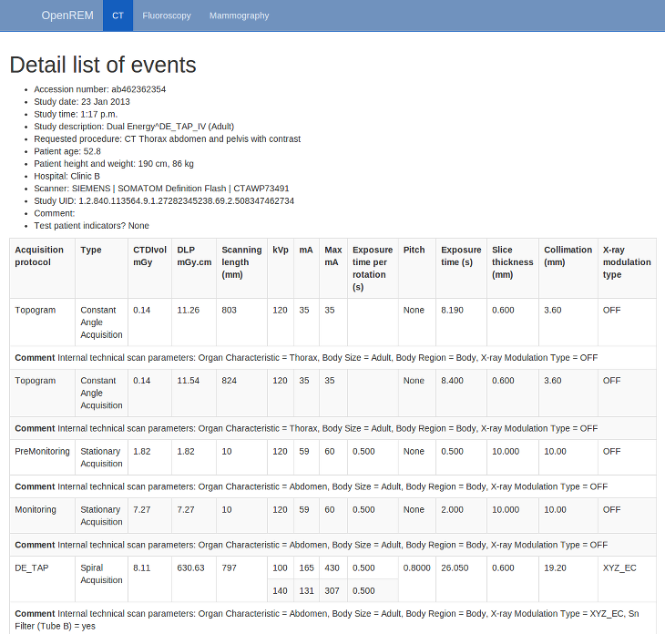

Navigating, filtering and study details
***************************************

Navigating the OpenREM web interface
====================================

Depending on your web server setup, your web interface to OpenREM will
usually be at http://yourserver/openrem or if you are using the test web
server then it might be at http://localhost:8000/openrem.

The home page for OpenREM should look something like this when it is 
populated with studies:

By selecting the links in the navigation bar at the top, you can view all
of the CT, fluoroscopy or mammography studies. Alternatively, if you click
on the station name link (in blue) you can filter to just that source modality.

*New in 0.4.0:* If you are not logged in, clicking any of the links will bring up the log in page.

Filtering for specific studies
==============================

This image shows the CT studies view, available to any logged in user, filtered by entering terms in the 
boxes on the right hand side to show just the studies where the modality
model name includes the term 'soma':

The search fields can all be used on their own or together, and they are
all case insensitive 'contains' searches. The exception is the date field,
where both from and to have to be filled in (if either are), and the format
must be ``yyyy-mm-dd``. There currently isn't any more complex filtering
available, but it does exist as `issue 17 <https://bitbucket.org/openrem/openrem/issue/17/>`_
for a future release.

The last box below the filtering search boxes is the ordering preference.

Viewing study details
=====================

By clicking on the study description link (in blue), you can see more 
details for an individual study:

Not all the details stored for any one study are displayed, just those thought
to be most useful. If there are others you'd like to see, add an issue to the tracker.

The final field in the summary at the top is called 'Test patient indicators?'
When studies are imported the ID and patient name fields are both ignored, but they
are parsed to check if they have 'phy', 'test' or 'qa' in them to help exclude them 
from the data analysis. If they do, then this information is added to the 
field and is displayed both in the web interface as a Test patient indicator 
and in the Excel export. The name and ID themselves are not reproduced, 
simply the presence of one of the key words. Therefore a patient named
'Phyliss' would trigger this, but only 'Phy' would be reproduced in this field.
Other fields will also help to confirm whether a study is for a real patient
such as the lack of an Accession Number and an unusual patient age.
